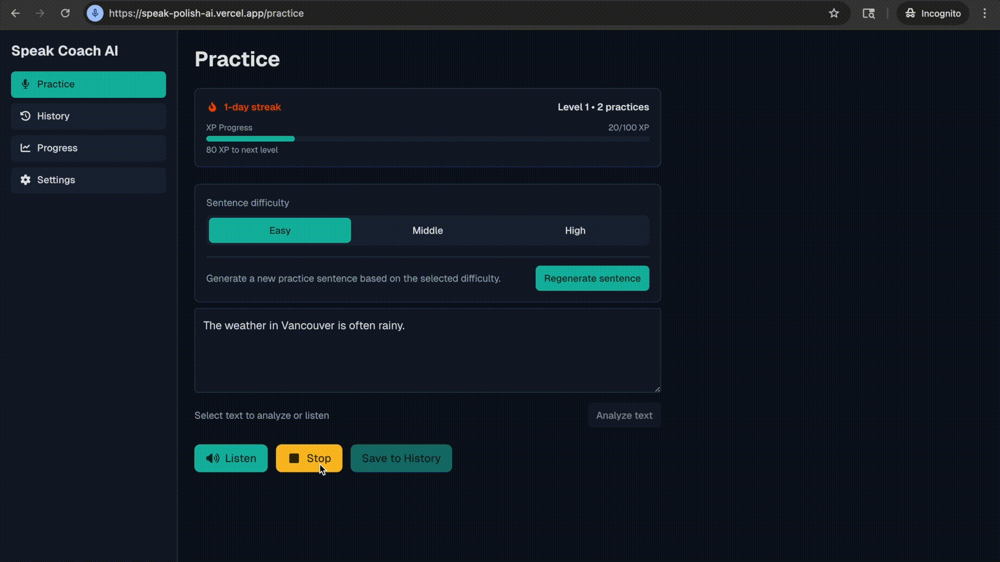

# Speak Coach AI

Live Demo: https://speak-polish-ai.vercel.app/

Speak Coach AI is an AI-powered speaking practice app built to make pronunciation training more actionable and repeatable. It combines audio-based pronunciation feedback, natural playback, in-place writing support, and lightweight progress tracking in a single frontend-driven learning workflow.

## What makes this app unique?

- Audio-first pronunciation coaching that evaluates how the learner actually speaks, not just what gets transcribed
- AI-generated TTS with partial replay, making it easier to repeat short phrases and practice difficult sections
- In-place grammar explanations and rewrite suggestions that can be applied directly to the user's sentence
- A resilient feedback pipeline that falls back from direct audio analysis to transcription-based evaluation when needed

## Overview

I built this project as a frontend-heavy AI product focused on turning technically complex interactions into a simple daily practice experience. The app lets users write or generate practice sentences, listen to natural playback, record their own voice, receive AI-generated pronunciation feedback, and track progress over time.

The product is aimed at non-native English speakers who need immediate, practical feedback without the friction of formal speaking tools or teacher-led sessions.

## Why I Built It

Speaking practice is hard to sustain because useful feedback is usually delayed, expensive, or too vague to act on. I wanted to build a tool that closes that loop quickly:

- Hear a natural example
- Practice the same sentence immediately
- Get feedback on how it sounded
- Rewrite unclear phrasing in place
- Keep momentum with visible progress

## Product Tour

### 1. Practice Screen

The main screen is designed around one focused loop: input, listen, speak, review, improve.



Users can:

1. Type a sentence manually or generate one by difficulty level (`Easy`, `Middle`, `High`)
2. Listen to natural TTS playback
3. Replay only the selected word or phrase with partial playback
4. Select text and request grammar explanations plus rewrite suggestions
5. Record their own voice and receive AI-generated pronunciation feedback
6. Save the result and continue building streak, XP, and level progress

### 2. History Screen

The history view keeps past practice sessions in one place so users can review what they practiced and how they performed.

- Previous sentence and correction
- Pronunciation score history
- A lightweight daily learning log

### 3. Progress Screen

The progress view adds motivation without overcomplicating the experience.

- Current streak
- Total practice count
- XP and level progression

### 4. Settings Screen

The settings view supports a flexible practice environment.

- Theme switching: `Light`, `Dark`, `System`
- AI feedback language: `English`, `Japanese`
- Persisted display and feedback preferences

## Tech Stack

- Next.js / React
- TypeScript
- OpenAI API for pronunciation feedback, transcription, and TTS
- Tailwind CSS
- Storybook
- Vercel

## How It Works

1. The user enters a sentence or generates one for practice.
2. The app sends text to `/api/tts` to generate native-like playback.
3. The user records their voice in the browser with `MediaRecorder`.
4. The app submits the audio file and target sentence to `/api/pronunciation-feedback`.
5. The server first transcribes the audio, then attempts direct audio-based pronunciation analysis.
6. If direct audio analysis fails, the server falls back to transcript-and-timing-based evaluation.
7. The user can also select text and send it to `/api/text-feedback` for grammar explanations and rewrite suggestions.
8. Practice results are saved locally to support streak, XP, level, and session history.

Under the hood, the app uses TTS for playback, ASR for transcription, and LLMs for pronunciation and writing feedback generation.

## Engineering Focus

This project was intentionally built as a frontend-centric AI product. The most important engineering work was not only calling models, but designing a UI and data flow that could handle real-world interaction cleanly.

- Coordinating asynchronous states across recording, playback, AI responses, and UI transitions
- Integrating browser audio APIs while keeping the interaction simple on both desktop and mobile
- Designing API routes as a lightweight backend layer for OpenAI integration and response normalization
- Converting raw AI outputs into stable, user-facing feedback structures
- Keeping the product responsive even when audio analysis is slow or partially unreliable

## Challenges and Decisions

### 1. Audio analysis reliability

Direct audio analysis produces better feedback, but it is also more fragile than text-only processing. To improve reliability, I added a fallback path that first transcribes the recording and then generates pronunciation feedback from transcript differences and word timings.

### 2. Frontend state complexity

This app combines multiple asynchronous flows in a single screen:

- Audio recording
- TTS playback
- Partial replay for selected text
- AI text feedback
- AI pronunciation feedback
- Progress updates after saving

The implementation required careful state handling so that playback, recording, loading, and result views stayed predictable.

### 3. Product UX for AI features

AI features can easily feel opaque or overloaded. I focused on keeping the experience understandable by turning each capability into a concrete user action:

- `Listen`
- `Listen Selection`
- `Analyze text`
- `Record`
- `Save`

That reduced cognitive load and made the workflow feel more like guided practice than a collection of AI tools.

## Notes

- Pronunciation scoring is AI-driven and includes guardrails to avoid high scores for unrelated or non-English speech
- This is not a phoneme-level lab-grade assessment tool
- Browser support depends on `MediaRecorder` and microphone permissions
- Streak, XP, level, and history are stored in browser `localStorage`

## Setup

Node.js `20+` is required.

```bash
node -v
```

Create `.env.local`:

```bash
OPENAI_API_KEY=your_api_key

# Optional
OPENAI_AUDIO_ANALYSIS_MODEL=gpt-4o-audio-preview
OPENAI_MODEL=gpt-4.1-mini
OPENAI_TRANSCRIBE_MODEL=gpt-4o-mini-transcribe
OPENAI_TEXT_FEEDBACK_MODEL=gpt-4.1-mini
OPENAI_TTS_MODEL=gpt-4o-mini-tts
OPENAI_TTS_VOICE=alloy
```

## Getting Started

```bash
npm install
npm run dev
```

Open `http://localhost:3000` in your browser.
